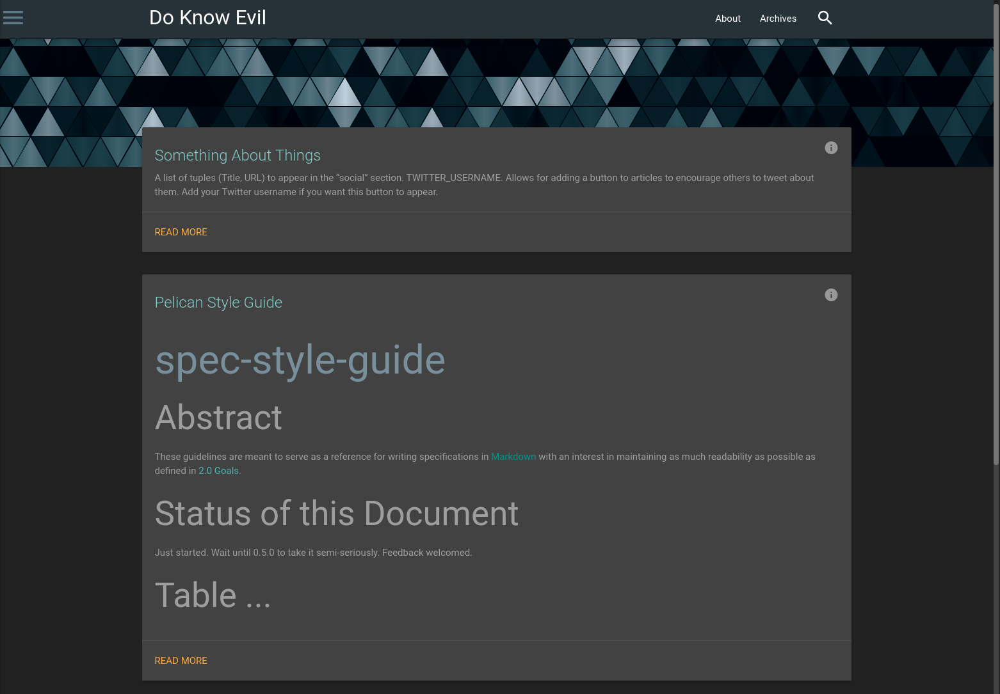

# doknowevil.net

I wanted a statically generated blog. I started with Pelican, and made a theme. No new content yet.



## Using

Standard Pelican stuff. You must be in the `site` directory. This assumes you have Pelican installed or are in a venv with Pelican installed.

### Build

```
make clean
make html
```

### Development

Start up the live-reload development server with:

```
make serve
```